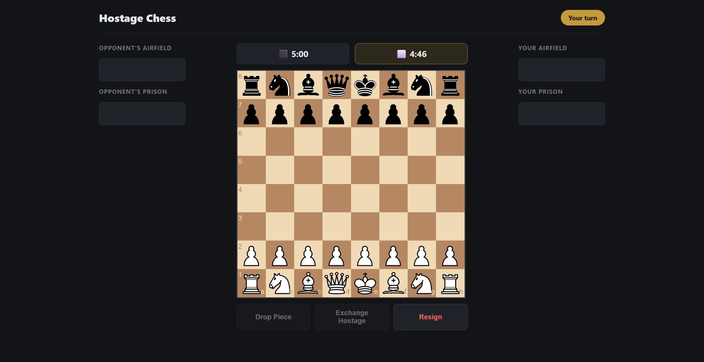
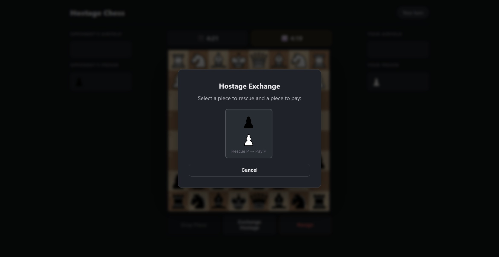
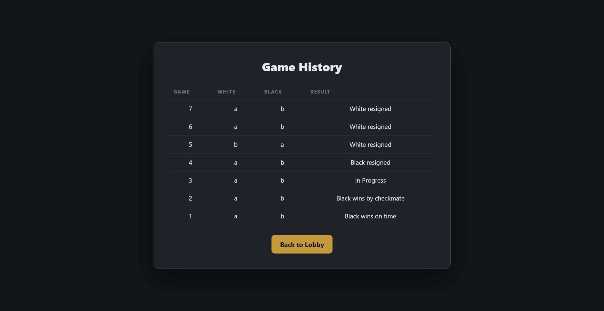

# Hostage Chess

[](https://github.com/haseebn19/hostage-chess/actions/workflows/ci.yml)


A multiplayer web-based implementation of Hostage Chess with full rules enforcement, real-time timers, and game history.

## Screenshots







## Features

- **Complete Hostage Chess rules**: Captures go to prison, drop pieces from your airfield, exchange hostages with piece-value validation
- **Server-side move validation**: All moves are validated by the game engine, making illegal moves impossible.
- **Real-time multiplayer**: Two-player HTTP polling architecture with automatic matchmaking
- **Timed games & Resignations**: 5-minute chess clock per player with automatic timeout handling and a manual resignation option
- **Game history & replay**: Browse past games and step through each move
- **Modern dark UI**: Clean responsive interface built with chessboard.js

## Prerequisites

- Python 3.11+

## Installation

```bash
git clone https://github.com/haseebn19/hostage-chess.git
cd hostage-chess

# Create virtual environment
python -m venv .venv

# Activate virtual environment
# On Windows:
.venv\Scripts\activate
# On macOS/Linux:
source .venv/bin/activate

# Install the package
pip install .
```

## Usage

```bash
python -m src 8080
```

1. Open `http://localhost:8080` in your browser
2. Enter a player handle and click **Play**
3. Open a second tab, enter a different handle, and join the game
4. Play chess! Drag pieces to make moves, use the **Drop Piece** and **Exchange Hostage** buttons for hostage mechanics

## Development

### Setup

```bash
# Create and activate virtual environment
python -m venv .venv
.venv\Scripts\activate  # Windows
source .venv/bin/activate  # macOS/Linux

# Install in editable mode with dev dependencies
pip install -e ".[dev]"
```

### Testing

```bash
pytest
```

With coverage:

```bash
pytest --cov=src --cov-report=html
```

### Linting

```bash
ruff check .
ruff format --check .
```

## Building

```bash
pip install build
python -m build
```

Output location: `dist/`

## Project Structure

```
hostage-chess/
├── src/
│   ├── engine/         # Pure-Python chess engine
│   │   ├── board.py    # Board state, FEN, serialisation
│   │   ├── moves.py    # Legal move generation
│   │   ├── hostage.py  # Prison, airfield, drops, exchanges
│   │   └── result.py   # Checkmate, stalemate detection
│   └── server/         # HTTP server
│       ├── app.py      # Routes and request handling
│       ├── database.py # SQLite operations
│       └── templates.py# HTML page templates
├── static/
│   ├── css/            # Custom styles
│   ├── js/             # Client-side game logic
│   ├── img/            # Chess piece images
│   └── vendor/         # Third-party libraries
├── tests/              # Test suite (100 tests)
├── .github/workflows/  # CI pipeline
├── pyproject.toml      # Project config
└── LICENSE             # MIT License
```

## Contributing

1. Fork the repository
2. Create a feature branch (`git checkout -b feature/amazing-feature`)
3. Commit your changes (`git commit -m 'Add amazing feature'`)
4. Push to the branch (`git push origin feature/amazing-feature`)
5. Open a Pull Request

## Credits

- [chessboard.js](https://chessboardjs.com/) - Board rendering and piece drag-and-drop
- [jQuery](https://jquery.com/) - DOM manipulation (required by chessboard.js)
- [Chess Pieces Sprite](https://commons.wikimedia.org/wiki/File:Chess_Pieces_Sprite.svg) - SVG chess pieces from Wikimedia Commons

## License

This project is licensed under the [MIT License](LICENSE).

---

*Originally developed for CIS\*2750 at the University of Guelph.*
